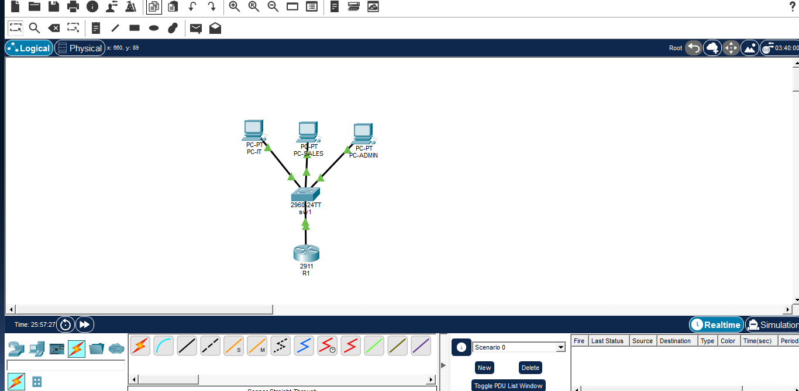
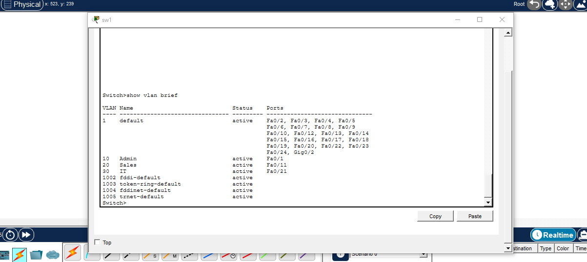
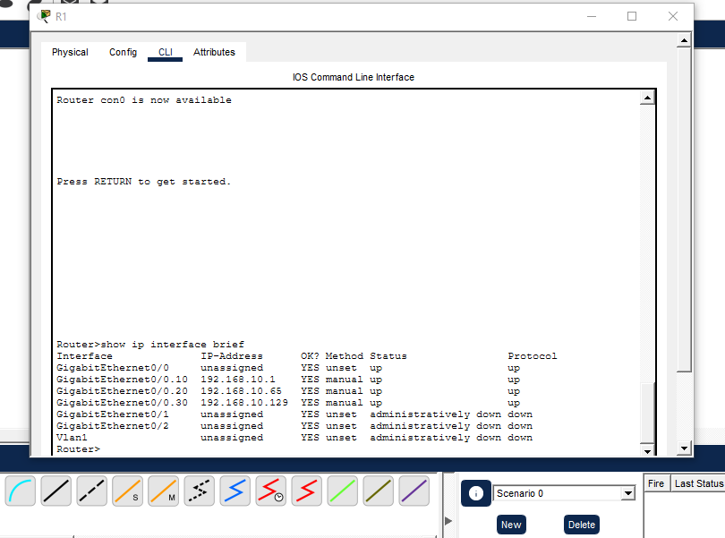

# Lab 1: Inter-VLAN Routing

Built in Cisco Packet Tracer. A small office network with three departments (Admin, Sales, IT). Each department has its own VLAN and subnet, and one router connects them using router-on-a-stick.

**Skills:** Subnetting (VLSM), VLANs, 802.1Q trunking, inter-VLAN routing, Cisco IOS CLI

## Topology



- **R1:** Cisco 2911 router
- **SW1:** Cisco 2960-24TT switch
- **Hosts:** PC-ADMIN (Fa0/1), PC-SALES (Fa0/11), PC-IT (Fa0/21)
- **Trunk:** SW1 Gi0/1 to R1 Gi0/0

## Addressing

I split `192.168.10.0/24` by the number of hosts in each department:

| Department | VLAN | Network | Usable range | Gateway |
|---|---|---|---|---|
| Admin (25 hosts) | 10 | 192.168.10.0/27 | .1 - .30 | 192.168.10.1 |
| Sales (50 hosts) | 20 | 192.168.10.64/26 | .65 - .126 | 192.168.10.65 |
| IT (10 hosts) | 30 | 192.168.10.128/28 | .129 - .142 | 192.168.10.129 |

Hosts: PC-ADMIN `192.168.10.2`, PC-SALES `192.168.10.66`, PC-IT `192.168.10.130`.

## Configuration

**Switch (SW1)**

```
vlan 10
 name Admin
vlan 20
 name Sales
vlan 30
 name IT

interface fastEthernet 0/1
 switchport mode access
 switchport access vlan 10
interface fastEthernet 0/11
 switchport mode access
 switchport access vlan 20
interface fastEthernet 0/21
 switchport mode access
 switchport access vlan 30

interface gigabitEthernet 0/1
 switchport mode trunk
```



**Router (R1)**

```
interface gigabitEthernet 0/0
 no shutdown

interface gigabitEthernet 0/0.10
 encapsulation dot1Q 10
 ip address 192.168.10.1 255.255.255.224
interface gigabitEthernet 0/0.20
 encapsulation dot1Q 20
 ip address 192.168.10.65 255.255.255.192
interface gigabitEthernet 0/0.30
 encapsulation dot1Q 30
 ip address 192.168.10.129 255.255.255.240
```



## Result

Ping from PC-ADMIN to PC-SALES works through the router. TTL is 127, which shows the packets crossed the router. The first request times out while ARP resolves.

## Next

Adding ACLs to control traffic between departments, then DHCP and NAT.
